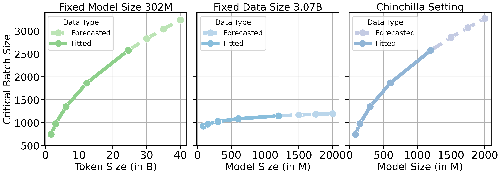

<div align="center">
  <br>
  <br>
  <h1>How Does Critical Batch Size Scale in Pre-training?</h1>
</div>

This repository contains official implementation for the paper ["How Does Critical Batch Size Scale in Pre-training?"](https://arxiv.org/abs/2410.21676) 

We find that CBS scales primarily with dataset size, not model size. For practitioners, this means that increasing batch sizes beyond the CBS does not yield significant efficiency gains and that focusing on dataset size is more beneficial for optimizing data parallelism. The findings may offer practical insights into efficient scaling strategies for pre-training large language models.

Please see our [Blog Post](https://kempnerinstitute.harvard.edu/research/deeper-learning/how-does-critical-batch-size-scale-in-pre-training-decoupling-data-and-model-size/) for a high-level overview of the paper.



## Installation

First install [PyTorch](https://pytorch.org) according to the instructions specific to your operating system.

To install from source, run:

```bash
pip install -e .[all]
```

## Data

We use Dolma to download and preprocess the data. 

```bash
cd dolma
pip install -e .
```

To download and preprocess the data, run:

```bash
python scripts/data/download.py
bash scripts/data/tokenizer.sh
```

## Models

We use transformer-based auto-regressive models in different sizes. The configurations can be found in `configs/critical-bs/${MODEL_SIZE}.yaml` directory.

## Running Experiments

Configurations to reproduce various experiments can be found in `configs/critical-bs` directory.

We use wandb sweeps for hyperparameter search (please refer to our paper for hyper-parameter details). To run a sweep, use the following command:

```bash
wandb sweep configs/critical-bs/sweeps/151M_sweep.yaml
CUDA_VISIBLE_DEVICES=0,1,2,3,4,5,6,7 wandb agent cbs/cbs/$SWEEP_ID
```

## Checkpoints

We disable checkpointing by default. To enable checkpointing, got to scripts/train.py and uncomment some lines related to checkpointing.


## Citation 
If you find this repo useful, please consider citing: 
```
@inproceedings{
    zhang2025how,
    title={How Does Critical Batch Size Scale in Pre-training?},
    author={Hanlin Zhang and Depen Morwani and Nikhil Vyas and Jingfeng Wu and Difan Zou and Udaya Ghai and Dean Foster and Sham M. Kakade},
    booktitle={The Thirteenth International Conference on Learning Representations},
    year={2025},
    url={https://openreview.net/forum?id=JCiF03qnmi}
}
@inproceedings{groeneveld2024olmo,
  title={Olmo: Accelerating the science of language models},
  author={Groeneveld, Dirk and Beltagy, Iz and Walsh, Pete and Bhagia, Akshita and Kinney, Rodney and Tafjord, Oyvind and Jha, Ananya Harsh and Ivison, Hamish and Magnusson, Ian and Wang, Yizhong and others},
  journal={Association for Computational Linguistics},
  year={2024}
}
```